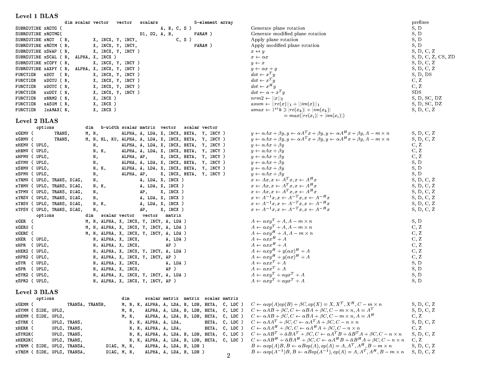

# Introduction to Numerical Methods with BLAS

This course is a practical introduction to numerical methods.
The fundamental concepts that govern the design and use of efficient libraries of numerical methods will be covered briefly.
Then, and overview of well established libraries will be provided followed by a practical session.

## Numerical libraries

The numerical libraries are categorized by the type of functions they implement, and the type of computational back-end they support.

In terms of computational back-end, libraries can support:
- single process evaluation (default),
- multiprocess evaluation, and
- offloading evaluation to accelerators.

Many libraries combine multiple back-end support, and often offer features that facilitate or even automate the selection of the optimal back-end in runtime (MAGMA/cuBLAS).

In terms of functions implemented, the categorization is much more extensive, but a few main categories are libraries implementing:
- matrix operations,
- operations on linear systems, and
- eigensolvers.

Eigensolvers: LAPACK (eignesolver component derived from EISPACK and were further developed), ARPACK, Anasazi, SLEPc, FEAST, and z-PARES

The current open source release of ARPACK is [ARPACK-NG](https://github.com/opencollab/arpack-ng).

_Sources_

- Tzounas, G. et al. (2020) ‘Comparison of Numerical Methods and Open-Source Libraries for Eigenvalue Analysis of Large-Scale Power Systems’, Applied Sciences. MDPI AG, 10(21), p. 7592. doi: [10.3390/app10217592](https://www.doi.org/10.3390/app10217592).

## An introduction to BLAS

BLAS (Basic Linear Algebra Subprogram) is one of the oldest numerical libraries. Currently, there are multiple implementations of the interface of BLAS, and a reference implementation published in the [Netlib](https://www.netlib.org/blas/) repository maintained by University of Tennessee Knoxville an Oak Ridge National Laboratory. Due to fundamental properties of computer architectures, all the implementations have a common interface and asymptotic performance, but performance optimizations implemented in various distributions can significantly improve practical performance.

BLAS implements basic linear algebra operations for dense matrix formats. The supported operations are grouped in three levels, according the underlying storage:

- **Level 1:** operations between vectors
- **Level 2:** operations involving products of a matrix with a vector
- **Level 3:** operations involving products of matrices

Single and double precision real and imaginary numbers are supported.

<figure markdown>
  [{ width="800" }](documents/blasqr.pdf)
  <figcaption><b>Document 1:</b> A list with the basic operation implemented by the BLAS interface; it includes a list of symbols for mapping names to mathematical operations.</figcaption>
</figure>

_Sources_

- [BLAS Technical Forum](https://www.netlib.org/blas/blast-forum/)
- [Basic Linear Algebra Subprograms Technical (BLAST) Forum Standard](https://www.netlib.org/blas/blast-forum/blas-report.pdf)
- [On computing Givens rotations reliably and efficiently](https://www.netlib.org/lapack/lawnspdf/lawn148.pdf)
- [GSL BLAS](https://www.gnu.org/software/gsl/doc/html/blas.html)

## Implementation details

Many libraries supporting sparse operations have to store indices. Pointers and doubles are always 64bits, where as indecencies for matrices can be either 32bit (LP) or 64bit (ILP) integers. The 32bit indexing is a performance hack used to conserve memory, but it can be a problem when storing large matrices. In engineering applications such as FEA for instance, sparse matrices can easily exceed a few billion in each dimension.

Many libraries with sparse or dense matrices support both single and double accuracy computations. Some libraries like cuBLAS offer lower level precision or mixed precision arithmetic operations. Apart from memory savings, some architectures, namely GPU accelerators, can vectorize lower precision arithmetic operations withing the double precision pipeline. These operations are often used in machine learning applications.

## Learning outcomes 

*After this course, participants will be able to:*

- Understand how modern computer architecture determines how matrices are stored and how operations on matrices are performed.
- Understand how computation in accelerator peripheral devices differs from computations in the CPU.
- Implement and parallelize matrix computations within a single process.
- Understand and ustilize the optimizations avaiable.
- Select and use libraries for matrix computations that best fit their needs.
<!-- - Parallelize matrix computations over multiple processes. -->

## Prerequisites

A good knowledge of linear algebra is beneficial but not necessary for the course. Priority will be given to users with good experience with C/C++ and/or FORTRAN.
No GPU programming knowledge is required; however, knowing the OpenMP programming model is advantageous. 

## Computing resources
Participants attending the event will be given access to the [MeluXina supercomputer](https://luxprovide.lu/) during the session. To learn more about MeluXina, please consult the Meluxina overview and the [MeluXina – Getting Started Guide](https://docs.lxp.lu/).
