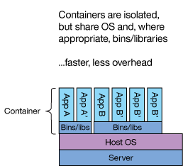

# Containers

Operating systems like GNU/Linux consists of 2 components, the kernel and the user space. The kernel contains the hardware drivers and provides interfaces for applications to access the hardware. For instance, the kernel provides functions for applications to write to storage devices. The user space contains libraries and executables required for programs to run. For instance the `glibc` package of Debian provides some version of the `libc` library that defines functions such as `malloc`. If you work on a RHEL based user space, you cannot use an application build for Debian based systems are they require a different version of `libc`. Containers solve this problem by creating isolated and swappable user spaces.

<figure markdown="span">
  { align=left width="400" }
  <figcaption>Fig. 1: Architecture of a simple container</figcaption>
</figure>

## Container technologies

The term _container_ describes a wide and loose set of technologies that enable software applications to run in isolated user spaces. The 3 main systems used in containers are the following.

- [_Chroot_](https://en.wikipedia.org/wiki/Chroot): a system operation that changes the apparent root directory for the current running process and its children.
- [_Namespaces_](https://en.wikipedia.org/wiki/Linux_namespaces): a Linux kernel feature that limits the resources that a set of processes can access; examples of resource include process IDs, user IDs, and interprocess communication mechanisms and groups.
- [_Control groups_ (`cgroups`)](https://en.wikipedia.org/wiki/Cgroups): a Linux kernel feature that limits, accounts for, and isolates the resource usage for collections of processes; resource include CPU cores, memory, and disk IOPs [1].

<figure markdown="span">
  { align=left width="400" }
  <figcaption>Fig. 2: Overview of technologies used in Linux containers</figcaption>
</figure>

## A toy example with Chroot

Before working on containers for HPC systems let's explore how `chroot`, a fundamental technology for containers, works. You should run this example in your personal machine, as the `chroot` command requires super user privileges (`sudo`). Modern containers use more sophisticated methods to control the access to resources, so no special privileges are required for most operations.

1. Create the root of the `chroot` file system:
   ```bash
   mkdir --parents ${HOME}/jail/{bin,lib,lib64,home/myusername}
   ```
2. Copy the executables that should be available in the `chroot` system:
   ```bash
   for binary in /bin/bash /bin/ls /bin/cat; do
     cp ${binary} ${HOME}/jail/bin/
   done; unset binary
   ```
3. Copy the linker:
   ```bash
   for linker in /lib64/ld-linux-x86-64.so*; do
     cp ${linker} ${HOME}/jail/lib64/
   done; unset linker
   ```
4. Copy the libraries required by the executables:
   ```bash
   while IFS="" read -r library; do
     cp ${library} ${HOME}/jail/lib/
   done < <(ldd /bin/bash /bin/ls /bin/cat | grep -E '=>' | awk 'BEGIN {FS="(=>)|( +)"} {print $4}' | sort | uniq); unset library
   ```
5. Create a text file to test the executables:
   ```bash
   echo 'Welcome to chroot jail!' > ${HOME}/jail/home/myusername/hello.txt
   ```

Your isolated environment is now created in `${HOME}/jail`. You can change to the `jail` environment with the command:
```console
$ sudo chroot ${HOME}/jail /bin/bash
bash-5.2# 
```

Any program running in the isolated environment cannot name and thus cannot access files outside the environment. Thus the term _jail_ is often used to describe an isolated environment created with `chroot`.

??? info "Accessing host system resources"

    In a typical system you may want to access more resources, like:

    - `/proc`, the process information pseudo-filesystem;
    - `/sys`, a mount point for the sysfs filesystem, which provides information about the kernel like `/proc`, but better structured;
    - `/dev`, special or device files, which refer to physical devices;
    - `/run`, a directory that contains information about processes that describes the system state;
    - your home directory under `/home`.

    You can use `man hier` to see more of the resource you may need to access inside a container.

    You can mount any resource files using bindings:
    ```bash
    for fs in dev dev/pts proc sys sys/firmware/efi/efivars run; do
      sudo mount --bind "/${fs}" "${system_root}/${fs}"
    done; unset fs
    ```

    However, this process involves a lot of manual work, and exposes system components to the jailed system. Containers automate this process and use systems such as namespaces to resolve the security issues.

## Containers for HPC systems

The main container systems used in HPC platforms are [Apptainer](https://apptainer.org/docs/user/latest/) and [Singularity](https://docs.sylabs.io/guides/latest/user-guide/). Both these container systems are built around the Singularity Image File (SIF) format of containers, and are interchangeable in most cases. There are other container format such as [Docker](https://www.docker.com/), but these systems are often not well suited for HPC applications.

??? info "Relation between Apptainer and Singularity"
    Singularity began as an open-source project in 2015, when a team of researchers at Lawrence Berkeley National Laboratory. The original project joined the [Linux Foundation](https://www.linuxfoundation.org/) and was renamed to Apptainer, where as the original Singularity code has been forked by the company Sylabs and distributed under various licenses and names.

### Why Singularity containers

Docker in particular contains some components that do not fit HPC system architecture well. Docker is composed by a daemon service (dockerd) and a client application (Docker client). This is a client-server architecture, where the client must run in the underlying system with root privileges and shares resources to the clients that run the containers. This posses 2 problems.

- Deployment: A daemon service with root access must run in each node of the cluster where a Docker container can run.
- Security: The daemon service must control which privileges are available to each container and user on top of the typical access privileges of each user. Otherwise, users can access unsanctioned resource through their containers since the daemon service has root privileges.

Singularity containers solve the problems of Docker type containers by using a simple service architecture. Each Singularity container runs in a simple Apptainer of Singularity process without the need for any services. Furthermore, the process running the container is launched by the user, so the user has inside the container the same privileges as in the underlying system and privilege escalation is not possible. Docker has introduced a daemonless and rootless mode in 2020, but Singularity type systems are much more mature in this aspect and offer other features that are more attractive for HPC systems.

### Container image formats

The containers are effectively a directory structure into which the system `chroot` together with a set of configuration files. These files can be stored in a number of formats. The SIF format is the format used natively but Apptainer and Singularity. The native formats for Docker are Docker tarballs and [OCI tarballs](https://github.com/opencontainers/image-spec/blob/main/image-layout.md) of the [Open Container Initiative](https://opencontainers.org/).

The main difference between SIF and tarball based formats is that tarball formats are a stack of layers. For instance, when building a OCI tarball one layer may include the Debian base image with `libc`, a second level may install Python, and a third level may install a python `venv`. The stack of layers is stored in a single tar ball and assembled dynamically in runtime.

A SIF container in a single file that is simply extracted and read at runtime, and more importantly SIF containers are static. For instance, an OCI tarball may require root privileges in a layer that installs Python system-wide at runtime, and since OCI tarballs are dynamic they require root privileges every time the container is run. The static nature of SFI container does away with the need for root privileges; Python is installed once when the container is created, and then the container is loaded with Python installed.

## Executing HPC containers

To run containers in HPC systems, you need access to Apptainer or Singularity executables and your container files. Containers for various applications can be found in [container registries](#container-registries), collections of repositories with container images.

Singularity based systems use SIF as their native format, but they can also load other container types such as Docker and OCI tarballs. On top of loading containers of multiple formats, SIF based container systems can also convert and store these containers in SIF format.

Singularity container applications can also work with sandboxes. Sandboxes are expansions of the binary SIF image file into a regular directory of the file system. The user may access and modify the sandbox form the host system or can launch the sandbox as a container and modify it from withing. Sandboxes is the primary mean of creating and modifying SIF containers. The operation of building a SIF container from a sandbox is monolithic and creates a single layer in contrast to tarball containers like OCI that may be built in layers.


## Further resources

### Popular container registries

- [Docker Hub](https://hub.docker.com/)
- [NVIDIA NGC Catalog](https://catalog.ngc.nvidia.com/containers)
- [AMD Infinity Hub](https://www.amd.com/en/developer/resources/infinity-hub.html)
- [Sylabs Cloud Library](https://cloud.sylabs.io/library)
- [RED HAT Quay.io](https://quay.io/)
- [BioContainers](https://biocontainers.pro/)

### Extra reading

- [Apptainer and MPI applications](https://apptainer.org/docs/user/latest/mpi.html)
- [GPU Support (NVIDIA CUDA & AMD ROCm)](https://apptainer.org/docs/user/latest/gpu.html)
- [Portable MPI containerization with the Process Management Interface (PMI)](https://ciq.com/blog/a-new-approach-to-mpi-in-apptainer/)
- [Docker vs Apptainer](https://www.linkedin.com/pulse/docker-vs-apptainer-anup-khanal-vxvxf/)
- [Container image formats under the hood](https://snyk.io/blog/container-image-formats/)

### References

1. Kurtzer, Gregory M., Vanessa, Sochat, and Michael W., Bauer. "Singularity: Scientific containers for mobility of compute"._PLOS ONE_ 12, no.5 (2017): e0177459, doi: [10.1371/journal.pone.0177459](https://www.doi.org/10.1371/journal.pone.0177459).
