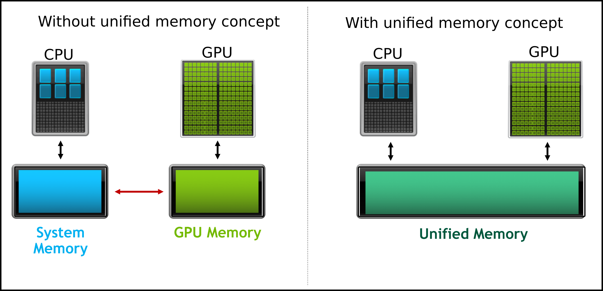

Unified memory simplifies the explicit data movement from host to device by programmers.
The CUDA API will manage the data transfer between CPU and GPU. In this example, we will investigate vector addition in GPU using the unified memory concept.


<figure markdown>

<figcaption></figcaption>
</figure>


 - Just one memory allocation is enough [`cudaMallocManaged()`](https://docs.nvidia.com/cuda/cuda-runtime-api/group__CUDART__MEMORY.html#group__CUDART__MEMORY_1gd228014f19cc0975ebe3e0dd2af6dd1b).
 The below table summarises the required steps needed for the unified memory concept.


|__Without unified memory__|__With unified memory__|
|----------------------|-------------------|
|Allocate the host memory|~~Allocate the host memory~~|
|Allocate the device memory|Allocate the device memory|
|Initialize the host value|Initialize the host value|
|Transfer the host value to the device memory location|~~Transfer the host value to the device memory location~~|
|Do the computation using the CUDA kernel|Do the computation using the CUDA kernel|
|Transfer the data from the device to host|~~Transfer the data from the device to host~~|
|Free device memory|Free device memory|
|Free host memory|~~Free host memory~~|


### <u>Questions and Solutions</u>


??? example "Examples: Unified Memory - Vector Addition"


    === "Without Unified Memory"

        ```c
        //-*-C++-*-
        // Without-unified-memory.cu
        
        #include <stdio.h>
        #include <stdlib.h>
        #include <math.h>
        #include <assert.h>
        #include <time.h>
        
        #define N 5120
        #define MAX_ERR 1e-6


        // GPU function that adds two vectors 
        __global__ void vector_add(float *a, float *b, 
                float *out, int n) 
        {

          int i = blockIdx.x * blockDim.x * blockDim.y + 
           threadIdx.y * blockDim.x + threadIdx.x;   
          // Allow the   threads only within the size of N
          if(i < n)
            {
              out[i] = a[i] + b[i];
            }

          // Synchronize all the threads 
          __syncthreads();
        }
 
        int main()
        {
          // Initialize the memory on the host
          float *a, *b, *out; 

          // Allocate host memory
          a = (float*)malloc(sizeof(float) * N);
          b = (float*)malloc(sizeof(float) * N);
          c = (float*)malloc(sizeof(float) * N);

          // Initialize the memory on the device
          float *d_a, *d_b, *d_out;

          // Allocate device memory
          cudaMalloc((void**)&d_a, sizeof(float) * N);
          cudaMalloc((void**)&d_b, sizeof(float) * N);
          cudaMalloc((void**)&d_out, sizeof(float) * N); 

          // Initialize host arrays
          for(int i = 0; i < N; i++)
            {
              a[i] = 1.0f;
              b[i] = 2.0f;
            }

          // Transfer data from a host to device memory
          cudaMemcpy(d_a, a, sizeof(float) * N, cudaMemcpyHostToDevice);
          cudaMemcpy(d_b, b, sizeof(float) * N, cudaMemcpyHostToDevice);

          // Thread organization 
          dim3 dimGrid(ceil(N/32), ceil(N/32), 1);
          dim3 dimBlock(32, 32, 1);
           
          // Execute the CUDA kernel function 
          vector_add<<<dimGrid, dimBlock>>>(d_a, d_b, d_out, N);

          // Transfer data back to host memory
          cudaMemcpy(out, d_out, sizeof(float) * N, cudaMemcpyDeviceToHost);

          // Verification
          for(int i = 0; i < N; i++)
             {
               assert(fabs(out[i] - a[i] - b[i]) < MAX_ERR);
             }

          printf("out[0] = %f\n", out[0]);
          printf("PASSED\n");

          // Deallocate device memory
          cudaFree(d_a);
          cudaFree(d_b);
          cudaFree(d_out);

          // Deallocate host memory
          free(a); 
          free(b); 
          free(out);
  
          return 0;
        }
        ```

    === "With Unified Memory - template"
   
        ```c
        //-*-C++-*-
        
        #include <stdio.h>
        #include <stdlib.h>
        #include <math.h>
        #include <assert.h>
        #include <time.h>

        #define N 5120
        #define MAX_ERR 1e-6


        // GPU function that adds two vectors 
        __global__ void vector_add(float *a, float *b, 
                                   float *out, int n) 
        {
          int i = blockIdx.x * blockDim.x * blockDim.y + 
            threadIdx.y * blockDim.x + threadIdx.x;   
          // Allow the   threads only within the size of N
          if(i < n)
            {
              out[i] = a[i] + b[i];
            }

          // Synchronice all the threads 
          __syncthreads();
        }

        int main()
        {
          /*
          // Initialize the memory on the host
          float *a, *b, *out;
    
          // Allocate host memory
          a = (float*)malloc(sizeof(float) * N);
          b = (float*)malloc(sizeof(float) * N);
          c = (float*)malloc(sizeof(float) * N);
          */
   
          // Initialize the memory on the device
          float *d_a, *d_b, *d_out;

          // Allocate device(unified) memory
          cudaMallocManaged......
  
         // Initialize host arrays
         for(int i = 0; i < N; i++)
           {
             d_a[i] = ...
             d_b[i] = ...
           }

         /*
         // Transfer data from host to device memory
         cudaMemcpy(d_a, a, sizeof(float) * N, cudaMemcpyHostToDevice);
         cudaMemcpy(d_b, b, sizeof(float) * N, cudaMemcpyHostToDevice);
         */

         // Thread organization 
         dim3 dimGrid...    
         dim3 dimBlock...

         // execute the CUDA kernel function 
         vector_add<<<dimGrid, dimBlock>>>(d_a, d_b, d_out, N);
         
         // synchronize if needed
         ......
         
         /*
         // Transfer data back to host memory
         cudaMemcpy(out, d_out, sizeof(float) * N, cudaMemcpyDeviceToHost);
         */
  
         // Verification
         for(int i = 0; i < N; i++)
           {
             assert(fabs(d_out[i] - d_a[i] - d_b[i]) < MAX_ERR);
           }

         printf("out[0] = %f\n", d_out[0]);
         printf("PASSED\n");
    
         // Deallocate device(unified) memory
         cudaFree...
         

         /*
         // Deallocate host memory
         free(a); 
         free(b); 
         free(out);
         */
  
         return 0;
        }
        ```
        
    === "With Unified Memory-version"
   
        ```c
        //-*-C++-*-
        // With-unified-memory.cu
        
        #include <stdio.h>
        #include <stdlib.h>
        #include <math.h>
        #include <assert.h>
        #include <time.h>

        #define N 5120
        #define MAX_ERR 1e-6


        // GPU function that adds two vectors 
        __global__ void vector_add(float *a, float *b, 
                                   float *out, int n) 
        {
          int i = blockIdx.x * blockDim.x * blockDim.y + 
            threadIdx.y * blockDim.x + threadIdx.x;   
          // Allow the   threads only within the size of N
          if(i < n)
            {
              out[i] = a[i] + b[i];
            }

          // Synchronize all the threads 
          __syncthreads();
        }

        int main()
        {
          /*
          // Initialize the memory on the host
          float *a, *b, *out;
    
          // Allocate host memory
          a = (float*)malloc(sizeof(float) * N);
          b = (float*)malloc(sizeof(float) * N);
          c = (float*)malloc(sizeof(float) * N);
          */
   
          // Initialize the memory on the device
          float *d_a, *d_b, *d_out;

          // Allocate device memory
          cudaMallocManaged(&d_a, sizeof(float) * N);
          cudaMallocManaged(&d_b, sizeof(float) * N);
          cudaMallocManaged(&d_out, sizeof(float) * N); 
  
         // Initialize host arrays
         for(int i = 0; i < N; i++)
           {
             d_a[i] = 1.0f;
             d_b[i] = 2.0f;
           }

         /*
         // Transfer data from a host to device memory
         cudaMemcpy(d_a, a, sizeof(float) * N, cudaMemcpyHostToDevice);
         cudaMemcpy(d_b, b, sizeof(float) * N, cudaMemcpyHostToDevice);
         */

         // Thread organization
         dim3 dimGrid(ceil(N/32), ceil(N/32), 1);
         dim3 dimBlock(32, 32, 1);
         
         // Execute the CUDA kernel function 
         vector_add<<<dimGrid, dimBlock>>>(d_a, d_b, d_out, N);
         cudaDeviceSynchronize();
         /*
         // Transfer data back to host memory
         cudaMemcpy(out, d_out, sizeof(float) * N, cudaMemcpyDeviceToHost);
         */
  
         // Verification
         for(int i = 0; i < N; i++)
           {
             assert(fabs(d_out[i] - d_a[i] - d_b[i]) < MAX_ERR);
           }

         printf("out[0] = %f\n", d_out[0]);
         printf("PASSED\n");
    
         // Deallocate device memory
         cudaFree(d_a);
         cudaFree(d_b);
         cudaFree(d_out);

         /*
         // Deallocate host memory
         free(a); 
         free(b); 
         free(out);
         */
  
         return 0;
        }
        ```

??? "Compilation and Output"

    === "Without-unified-memory.cu"
        ```c
        // compilation
        $ nvcc -arch=compute_70 Without-unified-memory.cu -o Without-Unified-Memory
        
        // execution 
        $ ./Without-Unified-Memory
        
        // output
        $ ./Without-Unified-Memory
        out[0] = 3.000000
        PASSED
        ```
        
    === "With-unified-memory"
        ```c
        // compilation
        $ nvcc -arch=compute_70 With-unified-memory.cu -o With-Unified-Memory
        
        // execution
        $ ./With-Unified-Memory

        // output
        $ ./With-Unified-Memory 
        out[0] = 3.000000
        PASSED
        ```


??? Question "Questions"

    - Here in this example, we have used **`cudaDeviceSynchronize()`**; can you remove **`cudaDeviceSynchronize()`**
      and still get a correct solution? If not, why (think)?
    - Please try using different thread blocks and array sizes. 

