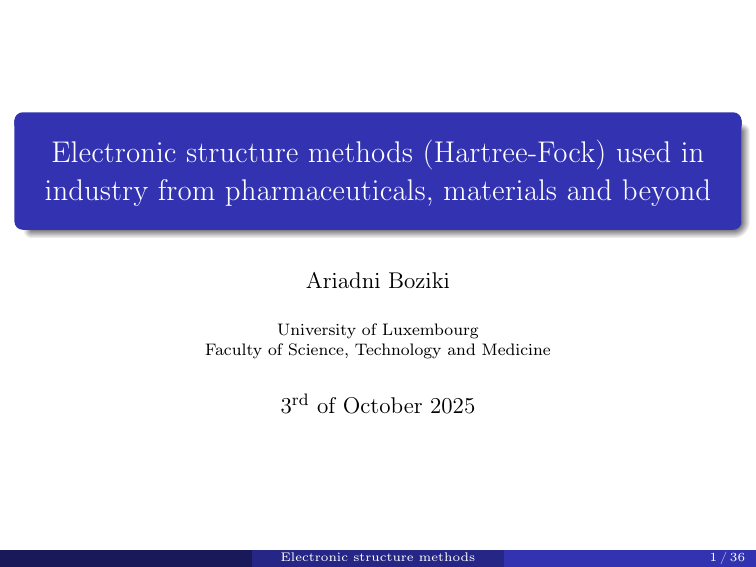

# Electronic structure methods (Hartree-Fock) used in industry from pharmaceuticals materials and beyond

> Author: [Ariadni Boziki](https://www.uni.lu/fstm-en/people/ariadni-boziki/) 
> email: [ariadni.boziki@uni.lu](mailto:ariadni.boziki@uni.lu)

## Lecture slides

<figure markdown>
[{: style='border:1px solid #000000' width='90%'}](files/Hartree-Fock.pdf)
<figcaption></figcaption>
</figure>

## Hands-on session

You can follow the hands-on session on "Hartree-Fock calculations in PySCF" either

- [online](Hartree-Fock_in_PySCF), or
- downloading the [PDF version](files/Hartree_Fock_Hands_on.pdf).
