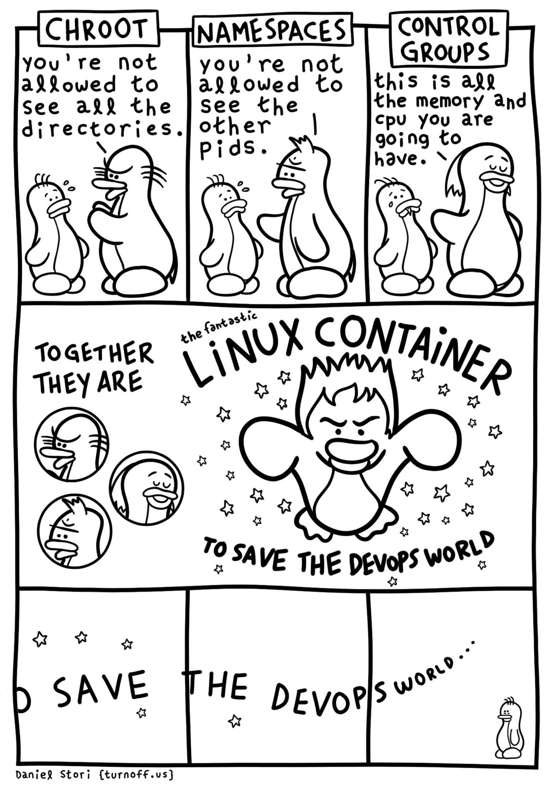

# Containers on HPC systems

The term _container_ describes a wide and loose set of technologies used to allow software applications to run in isolated user spaces (containers). The 3 main systems used in containers are the following.

- [_Chroot_](https://en.wikipedia.org/wiki/Chroot): a system operation that changes the apparent root directory and thus access to files (resources).
- _Namespaces_: a Linux kernel feature that allows mapping between resources; e.g. accessing mount points and network interfaces outside the container root.
- _Control groups_ (`cgroups`): a Linux kernel feature that limits, accounts for, and isolates the resource usage (CPU, memory, disk I/O, etc.[1]) of collections of processes.

<figure markdown="span">
  { align=left width="400" }
  <figcaption>Overview of technologies used in Linux containers</figcaption>
</figure>

## A toy example with Chroot

Before working on containers for HPC systems let's explore how `chroot`, a fundamental technology for containers, works. You should run this example in your personal machine, as the `chroot` command requires super user privileges (`sudo`). Modern containers use more sophisticated methods to control the access to resources, so no special privileges are required for most operations.

1. Create the root of the `chroot` file system:
   ```bash
   mkdir --parents ${HOME}/jail/{bin,lib,lib64,home/myusername}
   ```
2. Copy the executables that should be available in the `chroot` system:
   ```bash
   for binary in /bin/bash /bin/ls /bin/cat; do
     cp ${binary} ${HOME}/jail/bin/
   done; unset binary
   ```
3. Copy the linker:
   ```bash
   for linker in /lib64/ld-linux-x86-64.so*; do
     cp ${linker} ${HOME}/jail/lib64/
   done; unset linker
   ```
4. Copy the libraries required by the executables:
   ```bash
   while IFS="" read -r library; do
     cp ${library} ${HOME}/jail/lib/
   done < <(ldd /bin/bash /bin/ls /bin/cat | grep -E '=>' | awk 'BEGIN {FS="(=>)|( +)"} {print $4}' | sort | uniq); unset library
   ```
5. Create a text file to test the executables:
   ```bash
   echo 'Welcome to chroot jail!' > ${HOME}/jail/home/myusername/hello.txt
   ```

Your isolated environment is now created in `${HOME}/jail`. You can change to the `jail` environment with the command:
```console
$ sudo chroot ${HOME}/jail /bin/bash
bash-5.2# 
```

Any program running in the isolated environment cannot name and thus cannot access files outside the environment. Thus the term _jail_ is often used to describe an isolated environment created with `chroot`.

??? info "Accessing host system resources"

    In a typical system you may want to access more resources, like:

    - `/proc`, the process information pseudo-filesystem;
    - `/sys`, a mount point for the sysfs filesystem, which provides information about the kernel like `/proc`, but better structured;
    - `/dev`, special or device files, which refer to physical devices;
    - `/run`, a directory that contains information about processes that describes the system state;
    - your home directory under `/home`.

    You can use `man hier` to see more of the resource you may need to access inside a container.

    You can mount any resource files using bindings:
    ```bash
    for fs in dev dev/pts proc sys sys/firmware/efi/efivars run; do
      sudo mount --bind "/${fs}" "${system_root}/${fs}"
    done; unset fs
    ```

    However, this process involves a lot of manual work, and exposes system components to the jailed system. Containers automate this process and use systems such as namespaces to resolve the security issues.


## Containers in HPC systems

??? info "Further resources"

    - [Apptainer and MPI applications](https://apptainer.org/docs/user/latest/mpi.html)
    - [GPU Support (NVIDIA CUDA & AMD ROCm)](https://apptainer.org/docs/user/latest/gpu.html)
    - [Portable MPI containerization with the Process Management Interface (PMI)](https://ciq.com/blog/a-new-approach-to-mpi-in-apptainer/)

??? info "References"

    1. Kurtzer, Gregory M., Vanessa, Sochat, and Michael W., Bauer. "Singularity: Scientific containers for mobility of compute"._PLOS ONE_ 12, no.5 (2017): e0177459, doi: 10.1371/journal.pone.0177459.
